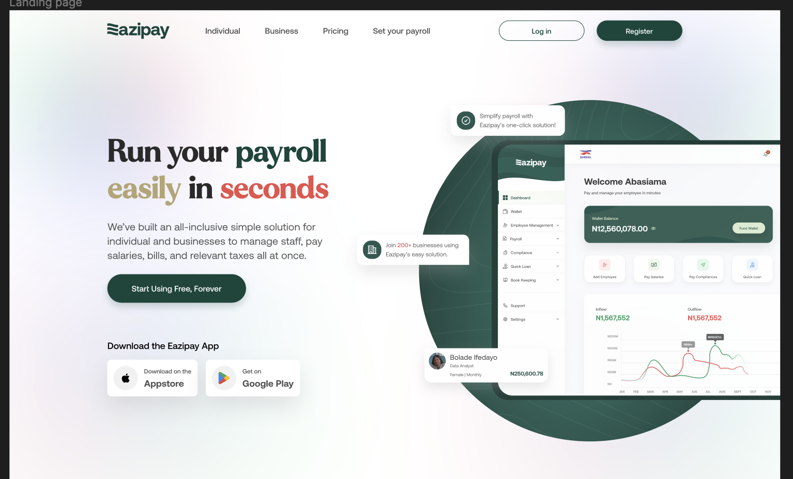

<h1>Eazipay Web Application</h1>
<h6><i>Enjoy your payment Schedule with the application</i></h6>

Hello, 👋 
<!-- Eazipay Web Application allows user to manage their travel plans. -->

<!-- Here's some notes about my submission:

1. A link to the project repository   https://github.com/olatunde1998/eazipay-app

2. A publicly live hosted URL of the challenge  https://travel-manager-app.vercel.app

Thank you very much.

Best regards\
Rasheed Olatunde -->

# Technologies 

 + [Typescript](https://www.typescriptlang.org/) 
 + [JavaScript](https://javascript.info/) 
 + [NextJs](https://nextjs.org/)
 + [React Chart-2.Js](https://react-chartjs-2.js.org/examples/line-chart/) 
 + [Vercel](https://vercel.com/dashboard) 
 + [Github Actions](https://docs.github.com/en/actions/)
 + [TailwindCss](https://tailwindcss.com/) 

# Prototype

 
# How to Contribute

1. Clone the repository 
$ git clone [https://github.com/olatunde1998/eazipay-app](https://github.com/olatunde1998/eazipay-app)

2. Change directory into the cloned folder and run the setup script
$ cd eazipay-app

3. Open your terminal and type this command `yarn install ` or `npm install` to add the react dependency to the app in the development mode.

4. Then after the installation of the  dependency type this command  `yarn dev` to run the app in your local environment 

5. Copy this link [http://localhost:3000/](http://localhost:3000/) and paste it to your web browser(Chrome, safari, mozilla firefox et.c) to view it.

# Deployment
Vercel was used to deploy the app. 
 + [Vercel](https://vercel.com/dashboard)

# License
The MIT License - Copyright (c) 2023 - Present, geodevcode/  Storage Service.

# Author
Rasheed Olatunde (Frontend Developer)
